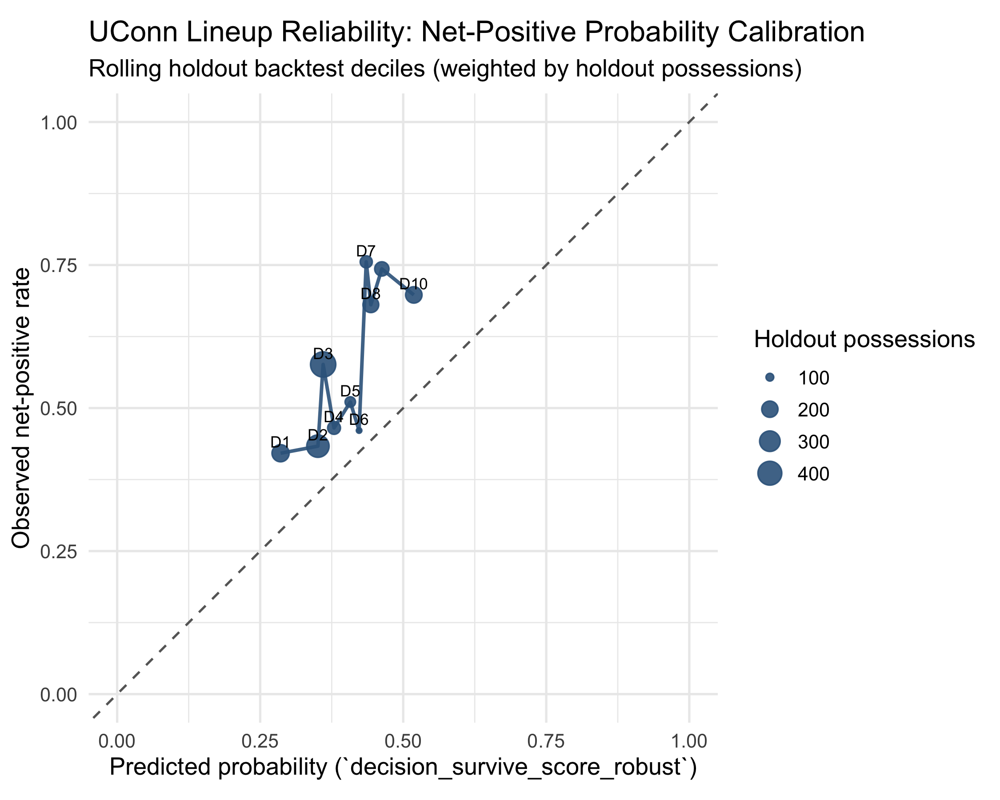
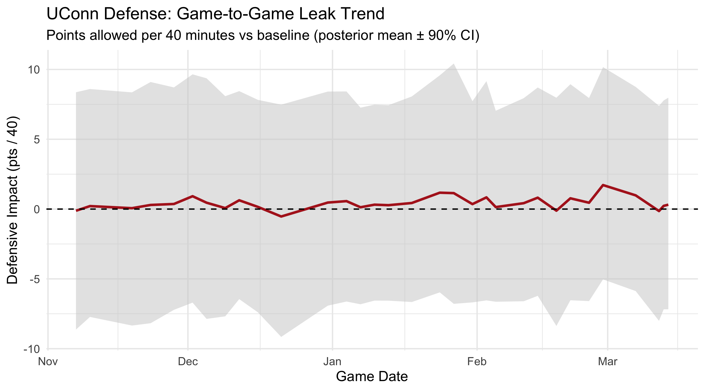

# UConn Men's Basketball — Coaching Analytics Platform

A Bayesian lineup optimization and defensive risk system built in **R** and **Stan** for the UConn Men's Basketball coaching staff. It turns play-by-play stint data into calibrated, auditable coaching recommendations — separating stable lineup signals from small-sample noise.

---

## Key Visuals

### Probability Calibration Curve
How reliably does the model's predicted "net-positive probability" match actual holdout outcomes?



### Game-Level Defensive Leak Trend
Are defensive breakdowns improving or compounding across the season?



---

## What This Project Does

| Module | What It Produces |
|---|---|
| **Lineup Optimization** | Bayesian net-PPP estimates, synergy posteriors, and decision labels (`PLAY MORE`, `LEAN IN`, `NEUTRAL`, `LIMIT / WATCH`, `TOO SMALL`) |
| **Defensive Leak Detection** | Lineup-level leak probabilities, game attribution, repeat-offender flags, and game-by-game trend |
| **Player Role Analysis** | Role concentration index (RCI), three-phase stability tracking, and creation profiles |
| **Decision Audit** | Rolling holdout backtests, Platt calibration, eligibility gates, and availability stress tests |
| **Opponent Scouting** | Shot maps, zone profiles, lineup matchups, turnover analysis, and clutch-event summaries from ESPN PBP |
| **Interactive Dashboard** | Shiny app with Coach View, Game Board, Player Out, and Technical Data tabs |

---

## Quick Start

### Prerequisites

- **R** (≥ 4.0) with packages: `data.table`, `ggplot2`, `rstan` or `cmdstanr`
- **Stan** (via CmdStan or RStan)
- Core input CSVs in `_data/01_core_inputs/` (see [Data Availability](#data-availability))

### Run the Full Pipeline

```bash
bash run_coaching_pipeline.sh
```

This executes 15 analysis steps in dependency order — from model fitting through QC gates.

### Run Everything (Pipeline + Scouts + Scheme Model)

```bash
bash run_everything.sh
```

### Launch the Dashboard

```bash
bash run_dashboard.sh
# → http://127.0.0.1:3838
```

---

## Project Structure

```
.
├── _scripts/
│   ├── pipeline/          # Orchestration: coaching pipeline, backtest, stress test
│   ├── models/            # Stan model fitting (core lineup, defense, scheme matchup)
│   ├── analysis/          # Post-fit tables, validation, calibration, attribution
│   ├── dashboard/         # Shiny dashboard (app.R, data_loader.R)
│   ├── ops/               # Cleanup, repair, manifest runner
│   └── utils/             # Shared helpers (paths, bootstrap, model utilities)
├── _models/               # Stan model files (.stan) + cached fits (.rds, gitignored)
├── _data/                 # Input CSVs (gitignored — see Data Availability)
├── _outputs/              # Generated CSVs, PNGs, scout reports (gitignored)
├── docs/
│   ├── REFERENCE.md       # Full internal reference documentation
│   └── images/            # Tracked images for README display
├── run_coaching_pipeline.sh
├── run_everything.sh
├── run_dashboard.sh
├── FINAL_FINDINGS.md      # Completed analytical findings
├── SUBMISSION_BRIEF.md    # Rubric-mapped submission summary
└── LICENSE                # MIT
```

---

## Pipeline Architecture

The coaching pipeline (`run_coaching_pipeline.R`) runs in a deliberate order — reliability checks upstream of recommendations:

1. **Defense leak model** → lineup leak posteriors
2. **Shot diet + creation profiles** → context primitives
3. **Rolling holdout backtest** → decision threshold evidence
4. **Probability calibration** → reliability diagnostics
5. **Core lineup model** → synergy + decision tables
6. **Player role tables** → RCI + phase stability
7. **Defense coach table + holdout validation** → watchlist language
8. **Stabilizers + attribution + trend** → game-level accountability
9. **Stress test + eligibility audit** → guardrail layer
10. **Output organization + post-flight QC** → final gate

> Reliability is upstream of recommendation language. The system decides whether confidence is earned before producing action labels.

---

## Bayesian Modeling

### Core Lineup Model (`uconn_lineup_gamelevel_offdef.stan`)
- **Outcome**: Net points per possession (possession-weighted)
- **Effects**: Player net effects + lineup synergy residual + opponent controls + site + game-state
- **Key feature**: Sum-to-zero constraints for identifiability; partial pooling prevents small-sample overreaction

### Defense Leak Model (`uconn_lineup_gamelevel_defonly.stan`)
- **Outcome**: Defensive PPP (points against per possession)
- **Signal**: `pr_leak = P(u_def > 0)` — posterior probability that a lineup leaks defensively beyond baseline

### Scheme Matchup Model (`uconn_scheme_matchup_ppp.stan`)
- **Outcome**: PPP by action × coverage matchup
- **Design**: Hierarchical action, coverage, interaction, team, and lineup effects with time-split validation

---

## Validation Philosophy

Validation is built into the workflow, not bolted on afterward:

- **Rolling backtests**: Train on prior games only, score next-game holdouts — strict no-leakage time ordering
- **Probability calibration**: Platt scaling with strict quality gates; conservative shrink-to-0.5 fallback when gates fail
- **Defensive holdout**: Time-split validation checks whether risk buckets separate actual holdout defense outcomes
- **Eligibility gates**: Block weak-sample or unstable lineups from reaching decision labels

Key validation scripts:
- [`evaluate_net_probability_calibration.R`](_scripts/analysis/evaluate_net_probability_calibration.R)
- [`run_rolling_lineup_decision_backtest.R`](_scripts/pipeline/run_rolling_lineup_decision_backtest.R)
- [`validate_defensive_leak_signal_holdout.R`](_scripts/analysis/validate_defensive_leak_signal_holdout.R)

---

## Data Availability

This repo tracks **source code only**. Private data and generated outputs are gitignored.

### Required Input Files (not included)

| File | Location | Purpose |
|---|---|---|
| `uconn_stints_from_pbp.csv` | `_data/01_core_inputs/` | Stint-level play-by-play data |
| `uconn_games_meta.csv` | `_data/01_core_inputs/` | Game metadata (dates, opponents, site) |
| `opponent_controls.csv` | `_data/01_core_inputs/` | Opponent adjusted efficiency ratings |

The pipeline will fail fast with clear error messages if any required input is missing.

### Public Data Path

ESPN play-by-play data can be generated via:
```bash
Rscript --vanilla _scripts/analysis/generate_manual_game_csvs_from_espn.R
```
This uses the `hoopR` package to pull public ESPN college basketball data.

---

## Key Findings (2025–26 Season)

See [`FINAL_FINDINGS.md`](FINAL_FINDINGS.md) for the full report. Highlights:

- **14 of 126 lineup rows** reached full sample status; the rest are marked `low_sample`
- **Highest-volume stable lineup**: Ball Solo | Demary Jr. | Karaban | Mullins | Reed Jr. — 560 possessions, 23 games, raw net PPP +0.180
- **Top player by positive net probability**: Demary Jr., Silas — 0.868 posterior probability of positive net impact
- **Defensive leak detection**: 4 `LEAK RISK` rows, 19 `WATCH (LEAK SIGNAL)` rows identified
- **Decision validation**: 415 backtest rows across 27 holdout games and 2,073 holdout possessions

---

## Documentation

| Document | Purpose |
|---|---|
| [`SUBMISSION_BRIEF.md`](SUBMISSION_BRIEF.md) | Rubric-mapped project summary |
| [`FINAL_FINDINGS.md`](FINAL_FINDINGS.md) | Complete analytical findings report |
| [`docs/REFERENCE.md`](docs/REFERENCE.md) | Full internal reference (data dictionary, CSV contracts, file atlas, system logic, runbook) |

---

## License

MIT — see [`LICENSE`](LICENSE). The license covers source code only; local/private data and excluded third-party materials are not part of this license.
