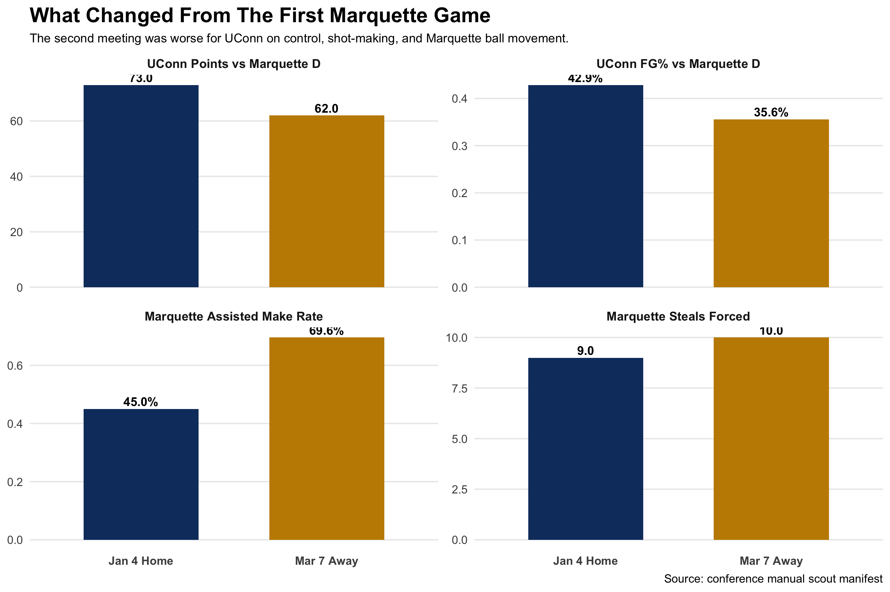

# Head Coach Brief | UConn at Marquette | March 7, 2026

Final: Marquette 68, UConn 62

## The Game In One Line

This was a control game, and we lost control of it.

## What Beat Us

- We had our lowest tracked offensive output of conference play: 62 points and 35.6% from the field on tracked shots.
- Marquette forced 10 steals. That tied for the highest number any conference opponent posted in the scout outputs.
- Marquette played much cleaner offense the second time. Their assisted make rate went from 45.0% in the first meeting to 69.6% in this one.

## What That Means

- We still got to the rim. That was not the issue.
- We did not make enough of the perimeter shots that were supposed to finish the possession.
- We let their ball movement get to the second and third pass too often.

## Rotation Note

Most of the game was still played in lineups the current pipeline likes, so this was not only a rotation problem.

The best settled group in this game was:

- Demary - Karaban - Mullins - Reed - Ross: plus-6 in 12 possessions

The lineup to keep an eye on was:

- Ball - Demary - Karaban - Reed - Ross: primary leak lineup in this game

If we see them again, the cleaner answer is not blowing up the rotation. It is leaning harder into the settled Reed groups and being more careful with the groups that already come in with collapse-risk.

## If We Play Them Again

- Keep the ball tighter against pressure.
- Stay home better once they get us in rotation.
- Make paint touches lead to points, not kick-out misses.
- Go back to the settled Reed groups faster if the game starts getting loose.

## Visual

